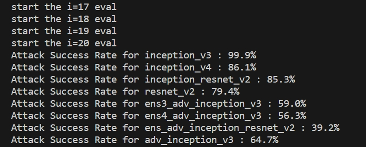

# Impact of changing gradient attacks on Adversarial Transferability

## env

+ Python = 3.7
+ req.txt

## Attack

### data and models

+ [data](https://drive.google.com/open?id=1CfobY6i8BfqfWPHL31FKFDipNjqWwAhS)
+ [model](https://drive.google.com/open?id=10cFNVEhLpCatwECA6SPB-2g0q5zZyfaw)


### attack

```
python Attack.py 
```

### eval

```
python Attack_eval.py
```


## Results
Number of samples set to 20 for each iteration.


